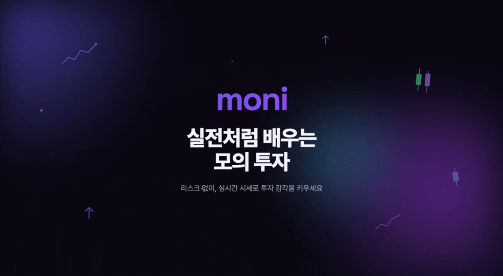
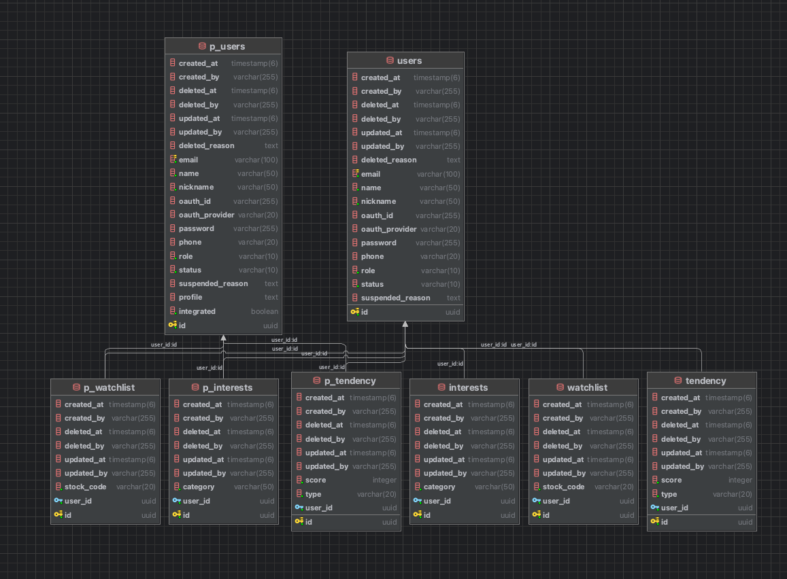
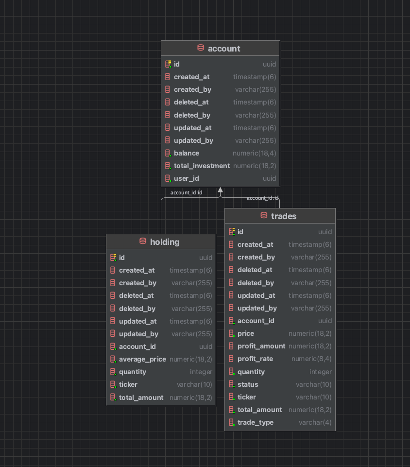
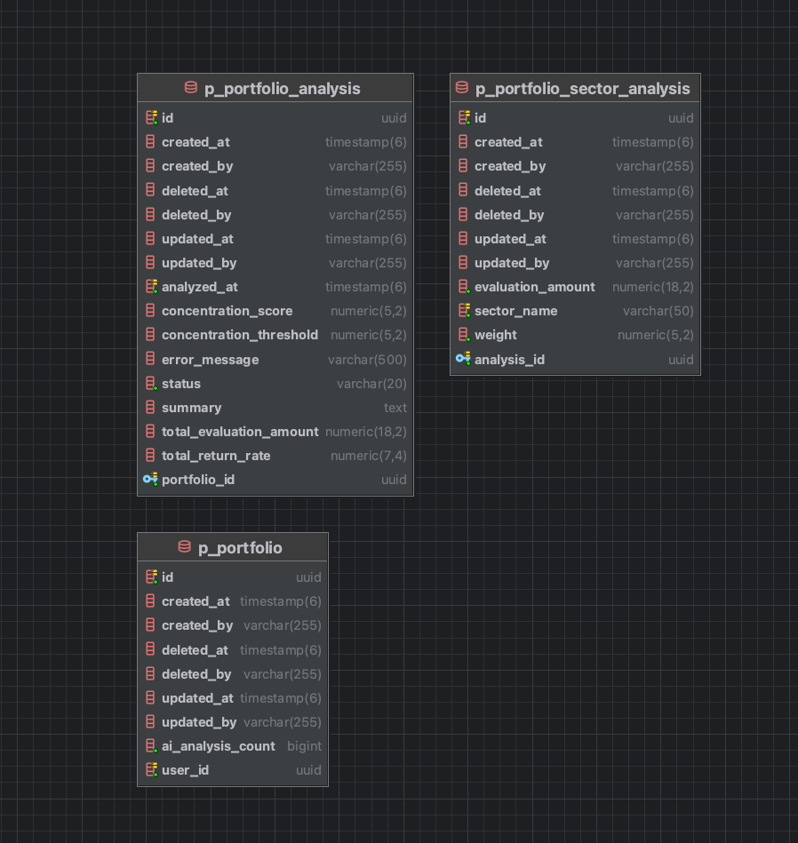
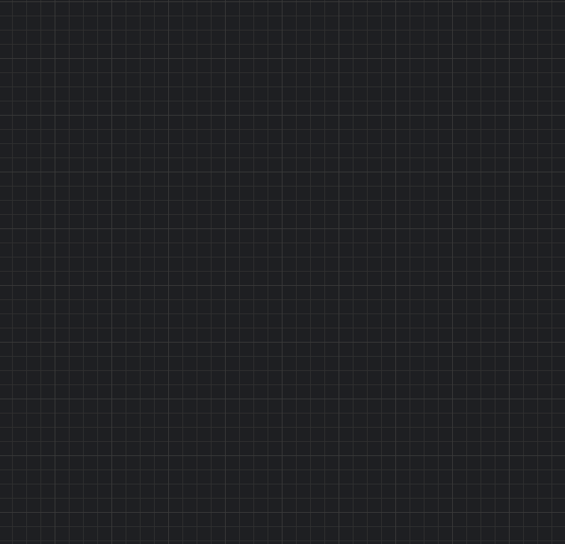
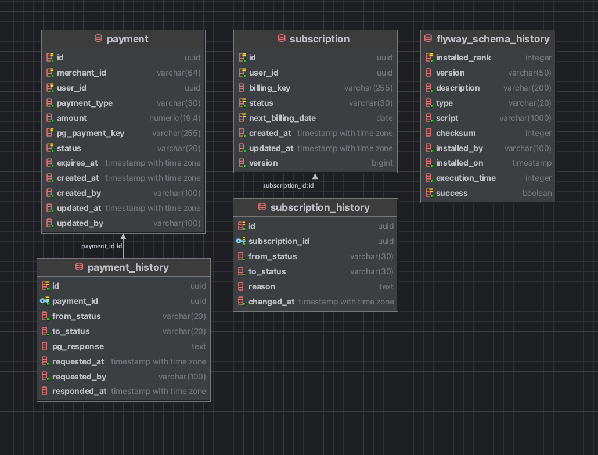
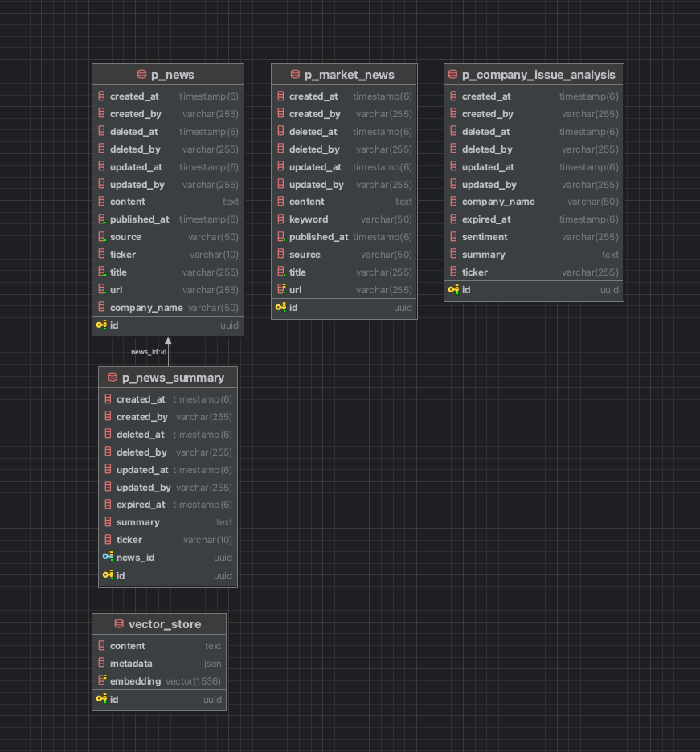
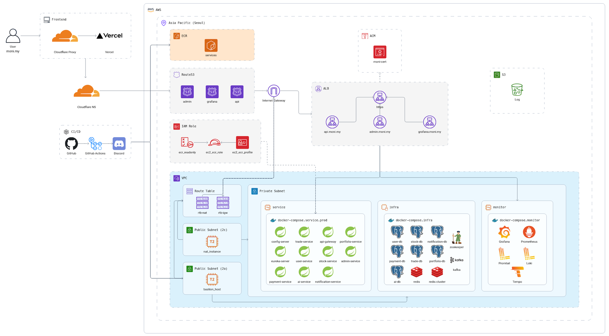
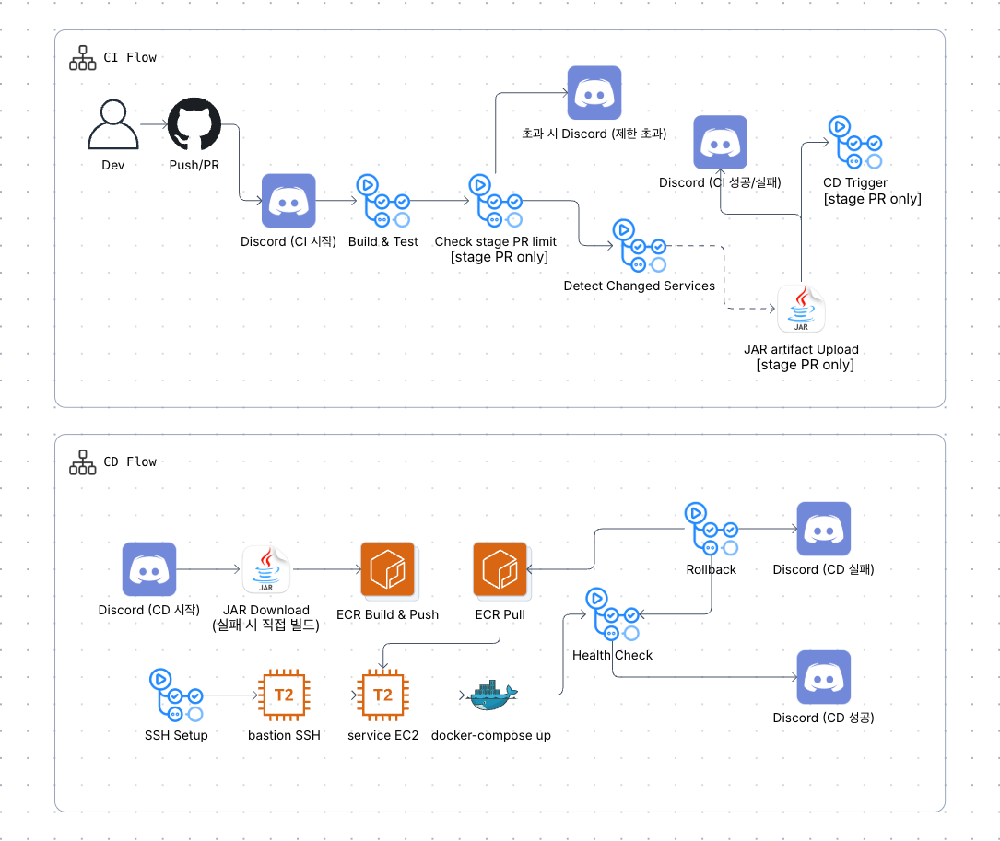

<!-- 상단 배너 이미지 교체 예정 -->
<div align="center">
  

  <h1>moni · 모니</h1>


  <p>MSA 기반 복잡한 금융 지표와 뉴스를 AI가 쉽게 풀어주는 초보자 친화적 모의 투자 플랫폼

<hr/>

<p align="center">
  <a href="#프로젝트-소개">소개</a> &nbsp;&bull;&nbsp;
  <a href="#프로젝트-목표">목표</a> &nbsp;&bull;&nbsp;
  <a href="#배포-주소">배포</a> &nbsp;&bull;&nbsp;
  <a href="#팀원-소개">팀원</a> &nbsp;&bull;&nbsp;
  <a href="#기술-스택">기술 스택</a> &nbsp;&bull;&nbsp;
  <a href="#마이크로서비스-구성">서비스 구성</a> &nbsp;&bull;&nbsp;
  <a href="#패키지-구조">패키지 구조</a> &nbsp;&bull;&nbsp;
  <a href="#도메인-정의">도메인 정의</a> &nbsp;&bull;&nbsp;
  <a href="#핵심-비즈니스-로직">비즈니스 로직</a> &nbsp;&bull;&nbsp;
  <a href="#erd-명세서">ERD</a> &nbsp;&bull;&nbsp;
  <a href="#api-명세서">API</a> &nbsp;&bull;&nbsp;
  <a href="#인프라-아키텍처">인프라</a> &nbsp;&bull;&nbsp;
  <a href="#cicd">CI/CD</a> &nbsp;&bull;&nbsp;
  <a href="#실행-방법">실행</a>
</p>

</div>

## 프로젝트 소개

초보 투자자를 위해 복잡한 금융 정보를 AI로 단순화하고, 실제 자금 없이 모의 매수·매도를 경험할 수 있는 **모의 투자 플랫폼**입니다.

- Spring Cloud(Eureka, Gateway, OpenFeign) 기반 멀티모듈 MSA
- OAuth2 소셜 로그인(Google, Kakao) + JWT 인증/인가
- Kafka 기반 비동기 이벤트 처리로 서비스 간 결합도 최소화
- Redis Cluster를 활용한 실시간 시세 캐싱
- pgvector + RAG 기반 기업 뉴스 분석 및 포트폴리오 AI 리포트 (ai-service)
- Okta OIDC 세션 인증 기반 관리자 웹 UI (admin-service, Thymeleaf SSR)
- Grafana Alloy · Loki · Tempo · Prometheus · Alertmanager · Grafana 기반 풀스택 모니터링 (로그 · 트레이싱 · 메트릭 · 알림)
- 모든 엔티티 Soft Delete 처리 (`deleted_at`, `deleted_by`)

### 관련 저장소

| 저장소                                                                           | 설명                                                          |
|:------------------------------------------------------------------------------|:------------------------------------------------------------|
| [moni-web](https://github.com/NaejusikSamjo/moni-web)                         | Next.js 16 기반 웹 클라이언트                                       |
| [moni-monitor](https://github.com/NaejusikSamjo/moni-monitor)                 | Grafana Alloy · Loki · Tempo · Prometheus · Grafana 모니터링 구성 |
| [moni-infra-terraform](https://github.com/NaejusikSamjo/moni-infra-terraform) | AWS 인프라 Terraform 코드                                        |

## 프로젝트 목표

추후 작성 예정

## 배포 주소

| 환경          | URL                                                |
|:------------|:---------------------------------------------------|
| 웹 클라이언트     | [https://www.moni.my](https://www.moni.my)         |
| API Gateway | [https://api.moni.my](https://api.moni.my)         |
| Admin       | [https://admin.moni.my](https://admin.moni.my)     |
| Grafana     | [https://grafana.moni.my](https://grafana.moni.my) |

## 팀원 소개

|                    **혜수 (Leader)**                     |                    **영욱 (Sub-Leader)**                    |                         **설아**                         |                          **동민**                           |                         **지은**                          |                          **동원**                           |
|:------------------------------------------------------:|:---------------------------------------------------------:|:------------------------------------------------------:|:---------------------------------------------------------:|:-------------------------------------------------------:|:---------------------------------------------------------:|
|  |  |  |  |  |  |
|        [@hyesuhan](https://github.com/hyesuhan)        |      [@kimyounguk1](https://github.com/kimyounguk1)       |        [@seola12e](https://github.com/seola12e)        |      [@DONGMIN-777](https://github.com/DONGMIN-777)       |       [@Jieunbakk](https://github.com/Jieunbakk)        |      [@won2dev-lab](https://github.com/won2dev-lab)       |
|        Notification Service<br>Payment Service         |                       Stock Service                       |                   Portfolio Service                    |                       Trade Service                       |                       AI Service                        |               User Service<br>Admin Service               |

## 기술 스택

| 분류           | 기술                                                                                                                                                                                                                                                                                                                                                                                                                                                                                                                                                                                                                                                                                                                                                                                                                                                                                                                                                                                                                                                                                         |
|:-------------|:-------------------------------------------------------------------------------------------------------------------------------------------------------------------------------------------------------------------------------------------------------------------------------------------------------------------------------------------------------------------------------------------------------------------------------------------------------------------------------------------------------------------------------------------------------------------------------------------------------------------------------------------------------------------------------------------------------------------------------------------------------------------------------------------------------------------------------------------------------------------------------------------------------------------------------------------------------------------------------------------------------------------------------------------------------------------------------------------|
| Backend      |           |
| Auth         |                                                                                                                                                                                                                                                                                                                                                                                                                                                                                                                                                                                                                                                                                                                                                                                                        |
| Database     |                                                                                                                                                                                                                                                                                                                                                                                                                                                                                                                                                                                                                                                                              |
| Messaging    |                                                                                                                                                                                                                                                                                                                                                                                                                                                                                                                                                                                                                                                                                                                                                                                                                                                                                                                                                                                      |
| Infra        |                                                                                                                                                                                                                                                                                          |
| Monitoring   |                                                                                                                                                                                                                                                                                                                                                                                                                                                     |
| External API |                                                                                                                                                                                                                                                                                                                                                                                                                                                                                                                                                                                      |
| Tools        |                                                                                                                                                                                                                                                                                                                                                                                                                                                                                                                                                                                                                                                                                                                                                                                                                                                                                                     |
| CI/CD        |                                                                                                                                                                                                                                                                                                                                                                                                                                                                                                                                                                                                                                                                                                                                                                                                                                                                                                                                                                         |

## 마이크로서비스 구성

| 서비스                  |  포트   | 핵심 기능                                                             |
|:---------------------|:-----:|:------------------------------------------------------------------|
| config-server        | 8888  | 중앙 설정 관리                                                          |
| eureka-server        | 8761  | 서비스 디스커버리                                                         |
| api-gateway          | 8080  | 라우팅, JWT 인증/인가, 외부 단일 진입점                                         |
| user-service         | 19090 | 회원가입/로그인, OAuth2, JWT 발급, 투자 성향·관심사·관심종목                          |
| trade-service        | 19091 | 모의 매수/매도, 거래 체결, 모의 계좌(balance) 관리                                |
| stock-service        | 19092 | 실시간 시세 (한국투자증권 KIS API), 종목 정보, 테마, 인기 종목 (Redis Cluster)         |
| portfolio-service    | 19093 | 포트폴리오 대시보드, 수익률 계산, AI 분석 연동                                      |
| notification-service | 19094 | 맞춤 알림 발송                                                          |
| payment-service      | 19095 | AI 분석 구독/결제 (토스)                                                  |
| ai-service           | 19096 | RAG 기반 기업 이슈 분석, 뉴스 요약/수집 (Naver), 포트폴리오 AI 리포트 (OpenAI + Gemini) |
| admin-service        | 19097 | 관리자 웹 UI (Thymeleaf SSR), Okta OIDC, 유저 조회/정지/삭제                  |

> 마이크로서비스 포트(19090~19097)는 내부 네트워크 전용이며 외부에 직접 노출되지 않습니다.
> 외부 요청은 API Gateway(8080)를 통해서만 접근 가능합니다.
> admin-service는 API Gateway를 우회하며 Okta OIDC 세션으로 독립 인증합니다.

### 인프라 구성

| 인프라             |     포트      | 설명                               |
|:----------------|:-----------:|:---------------------------------|
| user-db         |    25432    | 회원 DB (PostgreSQL)               |
| portfolio-db    |    25433    | 포트폴리오 DB (PostgreSQL)            |
| stock-db        |    25434    | 시세 DB (PostgreSQL)               |
| notification-db |    25435    | 알림 DB (PostgreSQL)               |
| trade-db        |    25436    | 거래 DB (PostgreSQL)               |
| payment-db      |    25437    | 결제 DB (PostgreSQL)               |
| ai-db           |    25438    | AI DB (PostgreSQL + pgvector)    |
| Redis Cluster   | 27000~27002 | 시세 캐시 (stock-service 전용, 3-node) |
| Redis           |    26379    | 세션/캐시 (그 외 서비스)                  |
| Zookeeper       |    22181    | Kafka 코디네이션                      |
| Kafka           |    29092    | 메시지 브로커                          |

## 패키지 구조

<details>
<summary>패키지 구조 보기</summary>

각 마이크로서비스는 기본적으로 **4계층 레이어드 아키텍처**를 따릅니다. DDD 개념(애그리거트, 도메인 이벤트)은 여력에 따라 선택적으로 적용합니다.

```
com.moni.<service>
├── global                # 전역 설정 — 공통 예외, 응답 포맷, 보안 설정, 공통 유틸
├── presentation          # 표현 계층 — Controller, Request/Response DTO, 예외 핸들러
│   ├── controller
│   └── dto
├── application           # 응용 계층 — Use-case 서비스, 트랜잭션 경계, 오케스트레이션
│   └── service
├── domain                # 도메인 계층 — Entity/VO, 비즈니스 규칙, 도메인 서비스
│   ├── entity (또는 model)
│   └── service
└── infrastructure        # 인프라 계층 — Repository 구현, FeignClient, Kafka, Redis
    ├── repository
    ├── client            # OpenFeign
    └── messaging         # Kafka Producer/Consumer
```

> **stock-service** 는 실시간 시세 처리의 특성상 **헥사고날 아키텍처(Ports & Adapters)** 를 적용합니다.
> 외부 어댑터(KIS API, WebSocket, Redis)를 포트로 추상화해 도메인 코드가 외부 의존성에 영향받지 않도록 분리합니다.

서비스 간 이벤트 발행은 `ApplicationEvent` → 인프라 리스너 → `KafkaTemplate` 구조를 권장합니다.
(메시징 교체 시 도메인·응용 계층 코드에 영향이 없도록 분리합니다.)

**common 모듈 설계 원칙:** `common`은 각 서비스가 직접 빈을 주입해서 사용하는 구조로, 공유 라이브러리 의존성 방식을 피했습니다. 처음부터 멀티모듈 분리 및 공통 라이브러리화가 즉시 가능한 구조로 설계되어 있습니다.

서비스별 도메인 구성:

```
user-service
├── auth/       # 로그인, JWT 발급, OAuth2 (Google/Kakao)
├── user/       # 사용자 엔티티, 투자 성향, 관심사, 프로필
└── admin/      # 관리자 전용 — 유저 조회/정지/삭제

trade-service
├── account/    # 모의 계좌 (현금 잔고, 보유 종목) — 소스 오브 트루스
├── trade/      # 매수/매도 주문 처리, 체결
└── holding/    # 보유 종목 내역

stock-service
├── stock/      # 종목 마스터, 실시간 시세, 인기 종목
└── theme/      # 테마별 종목 분류

portfolio-service
├── portfolio/  # 포트폴리오 대시보드, 수익률 계산
└── account/    # 조회·계산용 계좌 스냅샷 (trade-service 소유 데이터 참조)

notification-service
└── notification/  # 알림 설정, 발송 이력

payment-service
└── payment/    # 구독 플랜, 결제 처리 (토스 연동)

ai-service
├── news/       # 뉴스 수집, 요약 (RAG)
├── analysis/   # 기업 이슈 분석
└── report/     # 포트폴리오 AI 리포트 생성

admin-service
└── admin/      # 관리자 UI (Thymeleaf), 유저 목록/상세/제재 처리
```

</details>

## 도메인 정의

| 도메인          | 설명                                               |
|:-------------|:-------------------------------------------------|
| User         | 회원가입/로그인, OAuth2 소셜 인증, 투자 성향 측정, 관심 섹터·관심 종목 설정 |
| Trade        | 모의 매수/매도 체결, 모의 계좌(현금 잔고·보유 종목) 관리               |
| Stock        | 실시간 시세, 종목 마스터 데이터, 테마, 인기 종목, Redis Cluster 캐싱  |
| Portfolio    | 포트폴리오 대시보드, 자산 현황, 수익률 계산, AI 리포트 연동             |
| Notification | 가격 알림·공지 발송, 알림 수신 이력 관리                         |
| Payment      | AI 분석 기능 구독 플랜, 결제(아임포트 연동)                      |
| AI           | RAG 기반 기업 이슈·뉴스 분석, 포트폴리오 맞춤 리포트 생성              |
| Admin        | 관리자 전용 UI — 유저 목록 조회, 계정 정지/삭제, 뉴스 등록            |

### 상태 흐름

**사용자 계정**
```
ACTIVE(정상)
  → SUSPENDED(정지)   # 관리자 제재
  → DELETED(탈퇴/삭제)
```

**모의 거래 주문**
```
PENDING(주문 대기)
  → COMPLETED(체결 완료)
  → CANCELLED(주문 취소)
```

**결제/구독**
```
PENDING(결제 대기)
  → ACTIVE(구독 활성)
  → EXPIRED(구독 만료)
  → CANCELLED(구독 취소)
```

### 서비스 간 통신 원칙

> **사용자 응답에 꼭 필요한 것만 동기(OpenFeign), 나머지는 전부 비동기(Kafka)**

| 통신 방식          | 사용 사례                            |
|:---------------|:---------------------------------|
| OpenFeign (동기) | 매수 시 시세 조회, 포트폴리오 요약용 계좌 조회      |
| Kafka (비동기)    | 체결 후 포트폴리오 업데이트, 알림 발송, AI 분석 요청 |

FeignClient 호출에는 timeout을 명시하고 Resilience4j Circuit Breaker + Fallback을 적용합니다.

## 핵심 비즈니스 로직

추후 작성 예정

## ERD 명세서

<details>
<summary>ERD 보기</summary>

<!-- ERD 이미지 교체 예정 -->

### User


### Trade


### Stock


### Portfolio


### Notification


### Payment


### AI


</details>

---

## API 명세서

> **공통 사항**
> - Base URL: `http://localhost:8080/api/v1`
> - 인증: JWT (`Authorization: Bearer {token}`), 회원가입·로그인 API 제외
> - Content-Type: `application/json`

| 서비스                  | API 명세                                                                                                                                                                                                                                |
|:---------------------|:--------------------------------------------------------------------------------------------------------------------------------------------------------------------------------------------------------------------------------------|
| User Service         | [](https://editor.swagger.io/?url=https://raw.githubusercontent.com/NaejusikSamjo/moni/develop/docs/swagger/user-service.json)         |
| Trade Service        | [](https://editor.swagger.io/?url=https://raw.githubusercontent.com/NaejusikSamjo/moni/develop/docs/swagger/trade-service.json)        |
| Stock Service        | [](https://editor.swagger.io/?url=https://raw.githubusercontent.com/NaejusikSamjo/moni/develop/docs/swagger/stock-service.json)        |
| Portfolio Service    | [](https://editor.swagger.io/?url=https://raw.githubusercontent.com/NaejusikSamjo/moni/develop/docs/swagger/portfolio-service.json)    |
| Notification Service | [](https://editor.swagger.io/?url=https://raw.githubusercontent.com/NaejusikSamjo/moni/develop/docs/swagger/notification-service.json) |
| Payment Service      | [](https://editor.swagger.io/?url=https://raw.githubusercontent.com/NaejusikSamjo/moni/develop/docs/swagger/payment-service.json)      |
| AI Service           | [](https://editor.swagger.io/?url=https://raw.githubusercontent.com/NaejusikSamjo/moni/develop/docs/swagger/ai-service.json)           |

## 인프라 아키텍처



### Compose 파일 분리 구조

앱 재배포·핫픽스 적용 시 인프라(DB·Redis·Kafka)를 재시작하지 않도록 파일을 분리합니다.

| 파일                                | 역할                                                                             |
|:----------------------------------|:-------------------------------------------------------------------------------|
| `docker-compose.infra.yml`        | DB(PostgreSQL), Redis, Redis Cluster, Kafka, Zookeeper                         |
| `docker-compose.yml`              | 애플리케이션 서비스 — 로컬 개발용 (소스 빌드 기반)                                                 |
| `docker-compose.service.prod.yml` | 운영 배포용 — ECR 이미지 + OTEL javaagent + prod profile (`docker-compose.yml`과 함께 사용) |
| `docker-compose.monitor.yml`      | Tempo · Loki · Promtail · Prometheus · Grafana — 모니터링 전용 EC2에서 실행              |
| `docker-compose.alloy.yml`        | Grafana Alloy — 메트릭·로그·트레이스 수집, Loki·Prometheus·Tempo로 전송 (운영용)                |

## CI/CD



GitHub Actions 기반 파이프라인이 구성되어 있으며, 결과는 Discord 알림으로 수신합니다.

자세한 내용은 [배포 가이드 문서](docs/guides/deployment.md)를 확인하세요.

## 실행 방법

### 사전 요구사항

- Java 21
- Docker & Docker Compose

### 환경 변수 설정

프로젝트 루트에 `.env` 파일을 생성합니다. `.env.example`을 참고하세요.

```env
# --- AWS ---
CLOUDFRONT_DOMAIN=

# --- Database (서비스별 독립 DB) ---
USER_DB_USERNAME=          USER_DB_PASSWORD=          USER_DB_URL=
PORTFOLIO_DB_USERNAME=     PORTFOLIO_DB_PASSWORD=     PORTFOLIO_DB_URL=
STOCK_DB_USERNAME=         STOCK_DB_PASSWORD=         STOCK_DB_URL=
NOTIFICATION_DB_USERNAME=  NOTIFICATION_DB_PASSWORD=  NOTIFICATION_DB_URL=
TRADE_DB_USERNAME=         TRADE_DB_PASSWORD=         TRADE_DB_URL=
PAYMENT_DB_USERNAME=       PAYMENT_DB_PASSWORD=       PAYMENT_DB_URL=
AI_DB_USERNAME=            AI_DB_PASSWORD=            AI_DB_URL=

# --- Redis ---
REDIS_HOST=
REDIS_PORT=
REDIS_PASSWORD=

# --- Redis Cluster (stock-service) ---
REDIS_CLUSTER_HOST=
REDIS_CLUSTER_PORT_0=
REDIS_CLUSTER_PORT_1=
REDIS_CLUSTER_PORT_2=
REDIS_CLUSTER_PASSWORD=
REDIS_NODES=

# --- Kafka ---
KAFKA_HOST_IP=
KAFKA_PORT=
ZOOKEEPER_PORT=
KAFKA_BOOTSTRAP_SERVERS=

# --- JWT ---
JWT_SECRET_KEY=
JWT_ACCESS_TOKEN_EXPIRATION=
JWT_REFRESH_TOKEN_EXPIRATION=
GATEWAY_SECRET=

# --- OAuth2 (Google / Kakao) ---
GOOGLE_CLIENT_ID=          GOOGLE_CLIENT_SECRET=      GOOGLE_REDIRECT_URI=
KAKAO_CLIENT_ID=           KAKAO_CLIENT_SECRET=       KAKAO_REDIRECT_URI=
CORS_ALLOWED_ORIGINS=

# --- Okta (admin-service) ---
OKTA_CLIENT_ID=
OKTA_CLIENT_SECRET=
OKTA_ISSUER_URI=

# --- Okta (Grafana SSO) ---
OKTA_GRAFANA_CLIENT_ID=
OKTA_GRAFANA_CLIENT_SECRET=
OKTA_GRAFANA_ISSUER_URI=

# --- Observability ---
OTEL_EXPORTER_OTLP_ENDPOINT=   # 로컬: http://localhost:4317 / 운영: monitor EC2 private IP:4317
TEMPO_GRPC_PORT=
LOKI_PORT=
PROMETHEUS_PORT=
GRAFANA_PORT=
GRAFANA_ADMIN_USER=
GRAFANA_ADMIN_PASSWORD=
GRAFANA_ROOT_URL=

# --- Infrastructure ---
SERVICE_PRIVATE_IP=
INFRA_PRIVATE_IP=
ECR_REGISTRY=

# --- External API ---
NAVER_CLIENT_ID=        NAVER_CLIENT_SECRET=        NAVER_BASE_URL=
GEMINI_API_KEY=
OPENAI_API_KEY=         OPENAI_EMBEDDING_MODEL=
KIS_APP_KEY=            KIS_APP_SECRET=             KIS_WS_TR_ID=
TOSS_SECRET_KEY=
```

### 실행 순서

```bash
# 1. 저장소 클론
git clone https://github.com/NaejusikSamjo/moni.git
cd moni

# 2. .env 파일 생성 (위 내용 참고)

# 3. 인프라 먼저 시작 (DB, Redis Cluster, Kafka)
docker compose -f docker-compose.infra.yml up -d

# 4. Gradle 빌드 (Docker 이미지 생성 전 필수)
./gradlew clean build -x test

# 5. 앱 서비스 시작
docker compose up -d --build

# 6. 시작 순서 (healthcheck 기반 자동 관리)
# 1단계: config-server
# 2단계: eureka-server
# 3단계: api-gateway + 도메인 서비스 (user, trade, stock, portfolio, notification, payment, ai, admin)

# 7. 종료
docker compose down
docker compose -f docker-compose.infra.yml down
```


